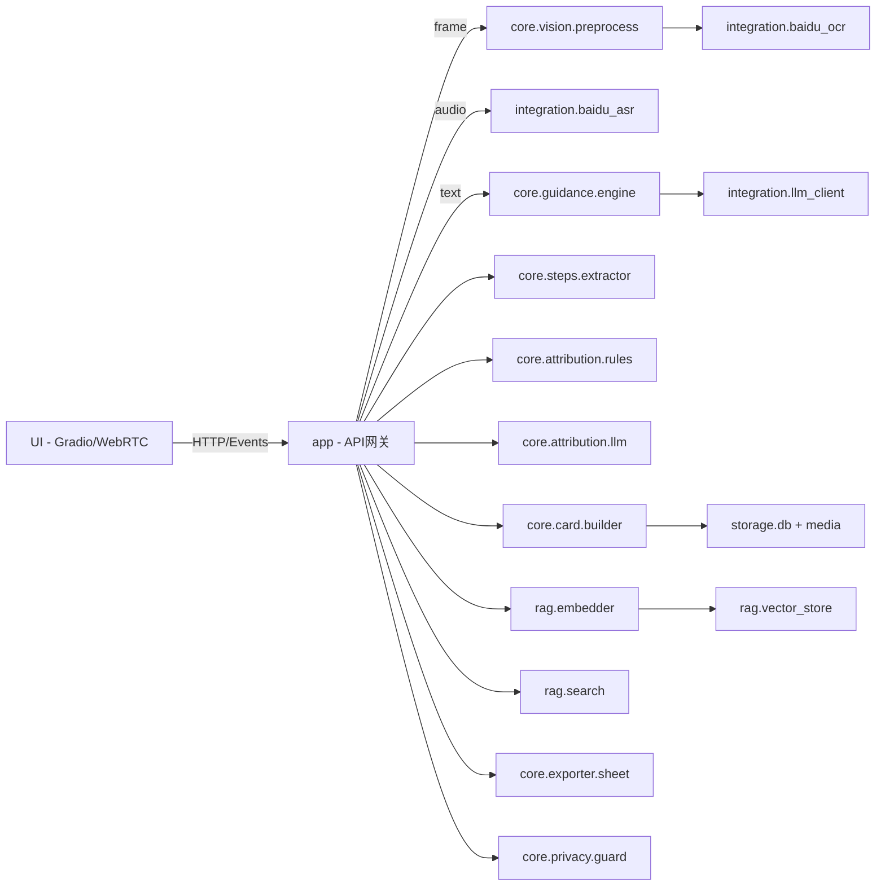
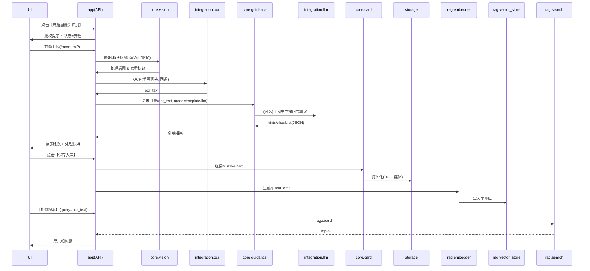
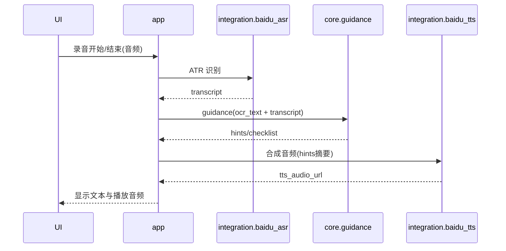
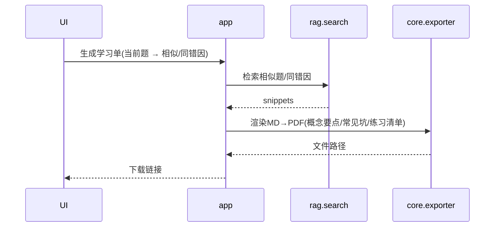

# Architect.md — mistake_note 架构说明（CPU 友好 · MVP 优先）

> 目标：摄像头**按需开启** → OCR（百度）/ASR（百度 ATR）→ LLM 提问式引导 → 错题卡入库 → RAG 检索 → 学习单导出。  
> 约束：**纯 CPU 可跑**（嵌入/索引/服务逻辑），外部能力走百度云 API；隐私合规、默认关闭摄像头。

---

## 1. 模块视图（Responsibilities）

### A. `ui`（前端 · Gradio / WebRTC）
- **职责**：用户交互层（摄像头/麦克风按需开启、状态提示、结果展示、下载导出）。
- **子组件**：
  - `CameraController`：开启/关闭视频流、显示预处理快照、ROI 选择框。
  - `MicController`：录音、静音检测、发起 ASR。
  - `GuidancePanel`：展示引导文案与音频播放（TTS）。
  - `StorageActions`：保存错题卡、发起检索、下载学习单。
- **调用**：HTTP 调用 `app` 暴露的 REST API（或 Gradio 事件回调）—— 下方列出接口。

### B. `app`（后端应用 · Python/FastAPI or Gradio Blocks）
- **职责**：统一 API 网关与编排（BFF）；鉴权/速率/日志；将业务请求路由到 `core`。
- **主要 API**：
  - `/camera/frame`（内部流回调）：接收抽帧图像 → 调用 `pipeline.vision`。
  - `/voice/asr`：接收音频 → `integration.baidu_asr`。
  - `/voice/tts`：文本 → `integration.baidu_tts`。
  - `/ocr/run`：图像 → `integration.baidu_ocr`（含预处理）。
  - `/guidance`：OCR/ASR 文本 + （可选）检索上下文 → `core.guidance`.
  - `/ingest/mistake_card`：保存错题卡 → `storage`.
  - `/search/[similar|same-error|by-concept]`：检索 → `rag.search`.
  - `/export/learning_sheet`：生成学习单 → `exporter`.

### C. `core`（业务核心）
- **职责**：面向领域的业务逻辑实现（与外设/存储解耦）。
- **子模块**：
  - `vision.preprocess`：灰度/阈值/透视矫正/去阴影；ROI 裁剪；感知哈希。
  - `guidance.engine`：**“不直答”**引导生成（模板→LLM）；自检清单。
  - `steps.extractor`：合并 OCR/ASR 文本，规范化为 2–4 步关键步骤。
  - `attribution.rules`：等式/单位/通分/符号等轻规则校验。
  - `attribution.llm`：错因归因结构化输出（JSON Schema）。
  - `card.builder`：装配 `MistakeCard`（数据契约见 §3）。
  - `exporter.sheet`：学习单模板渲染（MD→PDF）。
  - `privacy.guard`：开关日志、脱敏、同意记录、数据清除。

### D. `integration`（外部服务适配层）
- **职责**：与第三方 API 解耦，提供稳定接口与重试/退避。
- **组件**：
  - `baidu_ocr`：手写优先，回退公式/通用；超时重试；速率限制。
  - `baidu_asr`（ATR）：录音上传、静音切断、转写结果规整。
  - `baidu_tts`：文本合成音频、格式/语速/人声配置。
  - `llm_client`：LLM 网关（云/本地均可，支持函数式/JSON 输出）。
  - *可选* `paddle_ocr_fallback`：离线兜底（降精度）。

### E. `rag`（检索与索引）
- **职责**：嵌入生成与索引管理、检索与（可选）重排。
- **子模块**：
  - `embedder`：Sentence-Transformers（`bge-m3`，CPU）；支持 `q_text_emb / sol_text_emb / concept_emb / error_emb`。
  - `vector_store`：Chroma（HNSW）；分集合或字段型多向量。
  - `search`：组合检索（密集+可选稀疏）、过滤（年级/学科/难度/时间）。
  - `rerank`（可选）：轻量重排或 LLM-as-judge（离线）。

### F. `storage`（存储与数据访问）
- **职责**：持久化与对象存储。
- **组件**：
  - `db.sqlite`：错题卡结构化数据（SQLAlchemy/peewee）。
  - `media.store`：原图/预处理图/ROI/音频等文件至本地目录（或对象存储路径）。
  - `cache`：帧哈希缓存、文本哈希缓存（LRU / 本地 KV）。
  - `migrations`：数据迁移脚本；导入/导出工具。

### G. `platform`（平台与运维）
- **职责**：配置、日志、限流、监控、评估、压测。
- **组件**：
  - `config`：`.env` 加载与校验；热更新（可选）。
  - `logging`：脱敏日志；步骤级 trace id。
  - `rate_limit`：对外 API/第三方 API 的节流。
  - `metrics`：OCR/ASR/TTS 次数、延迟、缓存命中率。
  - `eval`：Recall@k / nDCG@k / 归因抽检报表脚本。
  - `bench`：CPU 性能压测、长稳性测试。

---

## 2. 交互关系（Call Graph · 高层）


## 3. 数据契约（主要 DTO）
### 3.1 MistakeCard（简化）
```json
{
  "id": "uuid",
  "timestamp": "ISO-8601",
  "student_id": "anon_001",
  "grade": "G6",
  "subject": "math",
  "topic_tags": ["一次方程","移项"],
  "difficulty": 3,
  "question_text": "已知2x+3=11，求x。",
  "student_solution_text": "2x=11-3, 2x=9, x=4",
  "voice_transcript": "我先把3移到右边…",
  "gold_solution_brief": "移项后2x=8, x=4（不直答，仅要点）",
  "error_type": ["计算错误"],
  "error_factors": ["移项后常数错算"],
  "reasoning_gaps": ["11-3应为8"],
  "recommendations": ["列一步一检清单：移项→化简→除以系数→检验"],
  "media": {
    "raw_image_url": "/media/raw/20250924_0815.jpg",
    "deskew_image_url": "/media/deskew/20250924_0815.jpg",
    "roi_image_url": "/media/roi/20250924_0815.jpg",
    "tts_audio_url": "/media/tts/20250924_0816.mp3"
  },
  "embeddings": {
    "q_text_emb": "…",
    "sol_text_emb": "…",
    "concept_emb": "…",
    "error_emb": "…"
  },
  "metadata": {
    "source": "camera+baidu_ocr",
    "lang": "zh",
    "hash": "phash_xxx",
    "pipeline_version": "v0.1.0"
  }
}
```

### 3.2 GuidanceRequest / Response
```json
// Request
{
  "ocr_text": "题目文本…",
  "voice_transcript": "口述思路…",
  "retrieved_snippets": [
    {"doc_id": "uuid", "text": "相似题干或同错因摘要", "error_type": ["计算错误"]}
  ],
  "mode": "template|llm"
}

// Response
{
  "hints": [
    "这是在解方程吗？先把常数项移到右侧，再统一系数…",
    "能否写下检验步骤？将x代回原式是否成立？"
  ],
  "checklist": [
    "是否正确移项？",
    "两边同除以2了吗？"
  ],
  "policy": {"no_direct_answer": true}
}
```

## 4. 关键流程（Sequence）
### 4.1 最小闭环：开启摄像头 → 引导 → 入库 → 检索

### 4.2 语音回路：ASR（ATR）输入与 TTS 播报

### 4.3 学习单导出

## 5. 运行时关注点（CPU & 成本 & 合规）
- CPU 友好：抽帧（1–2s/帧）、最长边 ≤720px、哈希去重；嵌入使用 bge-m3 CPU 推理；避免批量高并发。

- 成本控制：ROI 裁剪、缓存命中（帧哈希 & 文本哈希 ≥40%）、OCR QPS ≤0.7；ASR 静音截断。

- 隐私合规：默认关闭摄像头；显式同意弹窗；日志记录“由学生主动开启”；一键清除本地数据。

- 不直答：系统提示固定模板与安全词表；对触发“要答案”的请求给出引导而非结果。

## 部署与配置
单机开发：python app.py（Gradio/FastAPI），.env 提供 BAIDU 与 LLM Key。

**目录结构：**

```text
/app        # API 与编排（FastAPI/Gradio Blocks）
/core       # 业务逻辑
/integration# 外部适配
/rag        # 嵌入/索引/检索
/storage    # DB/媒体/迁移
/ui         # 前端组件（可与 app 合并）
/media      # 保存图像/音频/导出
/scripts    # 评估/压测/迁移
```

**可观察性：**
- 结构化日志
- 基本指标（调用次数/延迟/命中率）
- 本地文件或轻量时序库（可选）