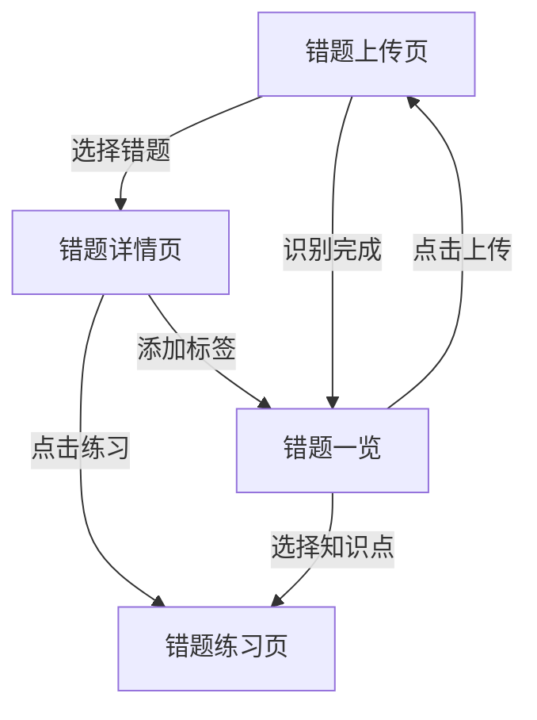
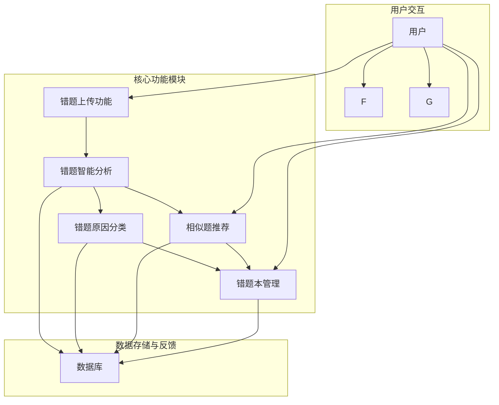
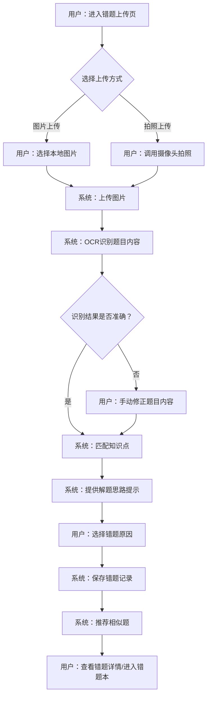

# 错题智析产品需求文档

## 1. 产品概述

### 1.1 产品名称与定位

*   **产品名称:** 错题智析
*   **产品定位:** 面向学生的智能错题管理与学习辅助平台，通过AI技术帮助学生高效整理、分析错题并进行针对性练习。

### 1.2 产品应用语言

*   **产品应用语言:** 简体中文

### 1.3 产品愿景与目标

*   **产品愿景:** 成为学生学习过程中不可或缺的智能错题分析与提升工具
*   **产品目标:**
    *   简化错题整理流程，提高学习效率
    *   提供精准的错题分析与个性化学习建议
    *   帮助学生建立完整的错题知识体系

### 1.4 产品使用终端

*   **主要终端:** Web端应用
*   **浏览器支持:** Chrome 90+、Firefox 88+、Safari 14+、Edge 90+

### 1.5 核心价值主张

*   **智能识别:** 拍照上传错题，AI自动识别题目与答案
*   **精准分析:** 深入解析错题原因，提供针对性指导
*   **个性练习:** 根据错题生成相似题目，强化薄弱知识点
*   **系统管理:** 按学科和知识点分类管理错题，清晰掌握学习状况

*   **智能识别:** 自动识别错题内容，快速生成结构化错题记录
*   **精准分析:** AI深度解析错题，提供标准答案和解题思路
*   **个性练习:** 根据错题生成相似题目，强化薄弱知识点
*   **标签管理:** 支持多标签分类，构建个人错题知识体系

### 1.6 目标用户群体分析

*   **主要用户:** 中小学生（6-18岁）
    *   **特征:** 处于知识积累关键期，面临大量练习和考试，需要高效整理和复习错题
    *   **需求:** 快速记录错题，深入理解错误原因，针对性练习相似题目，系统管理错题

### 1.7 核心功能模块

*   **错题上传模块:** 支持多张照片上传，AI识别题目内容和解答情况
*   **错题详情模块:** 展示错题识别结果，提供AI分析和对话功能，支持标签管理
*   **错题练习模块:** 根据错题生成相似题目，进行针对性练习
*   **错题一览模块:** 按学科和知识点汇总统计，展示薄弱知识点

### 1.8 浏览器兼容性要求

*   **桌面浏览器:**
    *   Google Chrome (90+)
    *   Mozilla Firefox (88+)
    *   Microsoft Edge (90+)
    *   Apple Safari (14+)
*   **分辨率支持:** 768x480及以上分辨率，最佳体验为1920x1080
*   **响应式设计:** 支持桌面和平板设备访问，确保在不同屏幕尺寸上提供良好体验

## 2. 功能规格

### 2.1 功能模块详述

#### 2.1.1 错题上传功能

| 功能ID | 功能名称 | 功能描述 | 优先级 |
|--------|---------|---------|--------|
| F-UPLOAD_001 | 多图片上传 | 用户可通过点击上传按钮，从本地文件系统选择多张错题图片（支持JPG、PNG格式）进行批量上传。 | P0 |
| F-UPLOAD_002 | 拍照上传 | 用户可通过Web端调用摄像头进行拍照，直接上传错题图片，支持连拍多张。 | P0 |
| F-UPLOAD_003 | 错题识别 | 调用coze工作流进行错题识别，解析题目、答案和作答情况，返回结构化数据。 | P0 |
| F-UPLOAD_004 | 识别结果展示 | 工作流返回后，按题目列表展示题干内容以及对错状态。 | P0 |
| F-UPLOAD_005 | 错题选择 | 学生可从识别结果列表中选中需要保存的错题，进入错题详情页。 | P0 |

#### 2.1.2 错题详情功能

| 功能ID | 功能名称 | 功能描述 | 优先级 |
|--------|---------|---------|--------|
| F-DETAIL_001 | 错题信息展示 | 展示学生的解答内容和AI返回的标准答案及分析。 | P0 |
| F-DETAIL_002 | AI对话功能 | 提供AI对话框，支持流式聊天，帮助学生进一步分析错题原因。 | P0 |
| F-DETAIL_003 | 错题标签 | 支持添加多标签，标记错题原因及知识点。 | P0 |
| F-DETAIL_004 | 练习入口 | 提供"练习"按钮，点击进入错题练习页。 | P0 |

#### 2.1.3 错题练习功能

| 功能ID | 功能名称 | 功能描述 | 优先级 |
|--------|---------|---------|--------|
| F-PRACTICE_001 | 相似题生成 | 由AI根据原错题生成类似题目以及之前错过的相类似题目。 | P0 |
| F-PRACTICE_002 | 题目展示 | 展示生成的练习题，提供答题区域。 | P0 |
| F-PRACTICE_003 | 答案展示 | 点击"展示答案"后，显示标准答案及AI对该题的解析。 | P0 |

#### 2.1.4 错题一览功能</old_string>
</operation>
|--------|---------|---------|--------|
| F-OVERVIEW_001 | 学科分类 | 按学科对所有错题进行分类汇总。 | P0 |
| F-OVERVIEW_002 | 知识点统计 | 按知识点对所有错题进行统计分析。 | P0 |
| F-OVERVIEW_003 | 薄弱知识点展示 | 识别并展示学生的薄弱知识点。 | P0 |
| F-OVERVIEW_004 | 上传入口 | 提供"上传"按钮，点击进入错题上传页。 | P0 |
| F-OVERVIEW_005 | 知识点筛选 | 选择知识点后，可进入该知识点的错题练习页。 | P0 |

### 2.2 功能模块关系图



## 3. 数据结构设计

### 3.1 错题识别结果数据结构

```json
[
  {
    "id": "1.1",
    "section": "大题题干（如无可为空字符串）",
    "question": "小题自身题干（逐字）",
    "answer": "学生作答原文（逐字；可为空字符串）",
    "is_question": true,
    "is_correct": true,
    "correct_answer": "标准答案或等价答案（含单位/要点）",
    "comment": "若答错/未答：提供分步思路与核对要点；若答对则为""
  }
]
```

### 3.2 核心数据实体

*   **错题(ErrorQuestion)**
    *   `id`: 唯一标识
    *   `question`: 题目内容
    *   `student_answer`: 学生答案
    *   `correct_answer`: 正确答案
    *   `is_correct`: 是否正确
    *   `subject`: 学科
    *   `knowledge_points`: 知识点标签列表
    *   `ai_analysis`: AI分析内容
    *   `upload_time`: 上传时间
    *   `practice_count`: 练习次数

## 4. 页面规格

| 功能ID | 功能名称 | 功能描述 | 优先级 |
|--------|---------|---------|--------|
| F-RECOMMEND_001 | 智能推荐相似题 | 根据当前错题的知识点、题型、难度等维度，智能推荐3-5道相似题目供学生练习。 | P0 |
| F-RECOMMEND_002 | 相似题练习 | 学生可直接在平台上完成推荐的相似题练习，并提交答案。 | P0 |
| F-RECOMMEND_003 | 相似题答案与解析 | 学生提交相似题答案后，系统立即给出对错判断，并提供详细解析。 | P0 |

#### 2.1.6 错题统计分析

| 功能ID | 功能名称 | 功能描述 | 优先级 |
|--------|---------|---------|--------|
| F-STATISTICS_001 | 按学科分类统计 | 统计各学科错题数量、正确率、薄弱知识点等数据。 | P0 |
| F-STATISTICS_002 | 按错误原因统计 | 统计各类错误原因的错题数量、占比及趋势。 | P0 |
| F-STATISTICS_003 | 薄弱知识点分析 | 基于错题数据，识别学生在哪些知识点上最容易出错，形成薄弱知识点报告。 | P0 |
| F-STATISTICS_004 | 正确率变化趋势 | 展示学生在不同时间段内，整体或特定知识点的正确率变化趋势图。 | P0 |
| F-STATISTICS_005 | 学习报告生成 | 定期（如每周、每月）生成学习报告，汇总错题情况、进步情况和学习建议。 | P1 |

#### 2.1.7 错题本管理

| 功能ID | 功能名称 | 功能描述 | 优先级 |
|--------|---------|---------|--------|
| F-MANAGE_001 | 错题列表展示 | 以列表形式展示所有错题，支持按学科、时间、错误原因等进行筛选和排序。 | P0 |
| F-MANAGE_002 | 错题详情查看 | 点击错题列表项，可查看错题的详细信息，包括题目图片、识别文本、答案、解析、错误原因、复习记录等。 | P0 |
| F-MANAGE_003 | 错题编辑与删除 | 用户可对已录入的错题信息进行编辑（如修改错误原因、补充笔记），或删除错题。 | P0 |
| F-MANAGE_004 | 错题导出 | 支持将错题列表或指定错题导出为PDF、Excel等格式，方便打印或离线查看。 | P1 |
| F-MANAGE_005 | 错题收藏 | 用户可将重要或难以理解的错题标记为收藏，方便快速查找和重点复习。 | P1 |

### 2.2 功能模块间的关系图



## 3. 用户流程

### 3.1 用户旅程地图

| 阶段 | 用户目标 | 用户行为 | 系统响应 | 痛点/机会点 | 情绪 |
|---|---|---|---|---|---|
| **发现错题** | 记录错题 | 发现作业/试卷中的错题 | - | 手动抄写耗时 | 😟 |
| **上传错题** | 快速录入 | 拍照或上传错题图片 | 智能识别题目内容 | 识别不准确 | 🙂 |
| **分析错题** | 理解错误 | 查看识别结果，选择错误原因 | 匹配知识点，提供解题思路 | 原因分类不清晰 | 😊 |
| **巩固练习** | 强化薄弱点 | 完成推荐的相似题 | 提供答案和解析 | 缺乏针对性练习 | 😄 |
| **复习回顾** | 避免再错 | 按计划复习错题，重做错题 | 记录复习情况，更新统计 | 复习无系统性 | 😁 |
| **查看报告** | 了解进步 | 查看错题统计和学习报告 | 展示数据图表和分析 | 无法量化学习效果 | 🤩 |

### 3.2 关键业务流程图

#### 3.2.1 错题上传与分析流程



### 3.3 各场景下的用户操作步骤

#### 3.3.1 场景一：上传并整理一道错题

1.  **用户操作:** 打开错题智析Web端，点击左侧导航栏的“错题上传”。
2.  **系统响应:** 进入错题上传页（P-UPLOAD），显示图片上传区域和拍照上传按钮。
3.  **用户操作:** 点击“图片上传”按钮，从本地选择一张错题图片。
4.  **系统响应:** 图片上传成功，系统开始进行OCR识别，并在页面上显示识别出的题目内容、答案和匹配的知识点。
5.  **用户操作:** 检查识别结果，若有错误则手动修改题目内容或答案。
6.  **系统响应:** 实时更新识别结果。
7.  **用户操作:** 在“错题原因”区域，选择“计算错误”。
8.  **系统响应:** 错题原因被记录。
9.  **用户操作:** 点击“保存错题”按钮。
10. **系统响应:** 错题成功保存到错题本，并自动跳转到错题详情页（P-ERROR_DETAIL），同时显示推荐的相似题。

#### 3.3.2 场景二：查看错题统计报告

1.  **用户操作:** 打开错题智析Web端，点击左侧导航栏的“学习报告”。
2.  **系统响应:** 进入学习报告页（P-REPORT），默认显示当前周的错题统计概览，包括各学科错题数量、错误原因占比饼图、薄弱知识点列表和正确率趋势图。
3.  **用户操作:** 点击“按学科分类统计”下的“数学”学科。
4.  **系统响应:** 页面内容更新，显示数学学科的详细错题统计，包括各章节错题数量、数学学科内的错误原因分布等。
5.  **用户操作:** 点击“薄弱知识点分析”中的某个知识点链接。
6.  **系统响应:** 页面跳转到错题本页（P-ERROR_BOOK），并自动筛选出该知识点下的所有错题。

## 4. 数据流设计

### 4.1 数据结构与关系

*   **学科 (Subject):**
    *   `subject_id` (PK)
    *   `subject_name` (e.g., 数学, 语文, 英语)
*   **知识点 (KnowledgePoint):**
    *   `kp_id` (PK)
    *   `kp_name` (e.g., 加减乘除, 拼音, 时态)
    *   `subject_id` (FK to Subject)
    *   `parent_kp_id` (FK to KnowledgePoint, for hierarchical structure)
*   **错题 (ErrorQuestion):**
    *   `eq_id` (PK)
    *   `session_id` (用于临时会话标识)
    *   `original_image_url` (存储上传图片的URL)
    *   `recognized_text` (OCR识别出的题目文本)
    *   `correct_answer` (正确答案)
    *   `user_answer` (用户提交的答案)
    *   `is_correct` (布尔值，用户答案是否正确)
    *   `kp_id` (FK to KnowledgePoint)
    *   `error_reason_id` (FK to ErrorReason)
    *   `custom_reason_text` (用户自定义原因文本)
    *   `upload_date`
    *   `last_review_date`
    *   `mastery_level` (掌握程度，如：未掌握, 一般, 已掌握)
    *   `is_collected` (是否收藏)
*   **错误原因 (ErrorReason):**
    *   `reason_id` (PK)
    *   `reason_name` (e.g., 概念不清, 计算错误, 粗心大意)
    *   `is_custom` (布尔值，是否为用户自定义)
    *   `user_id` (FK to User, if is_custom is true)
*   **相似题 (SimilarQuestion):**
    *   `sq_id` (PK)
    *   `eq_id` (FK to ErrorQuestion, 关联到哪道错题)
    *   `question_text`
    *   `correct_answer`
    *   `explanation`
    *   `difficulty_level`
*   **相似题练习记录 (SimilarPracticeRecord):**
    *   `spr_id` (PK)
    *   `user_id` (FK to User)
    *   `sq_id` (FK to SimilarQuestion)
    *   `practice_date`
    *   `user_answer`
    *   `is_correct`

### 4.2 关键数据流向图

```mermaid
graph TD
    subgraph "用户操作层"
        U1["用户上传图片"] --> A["图片存储服务"]
        U2["用户选择错误原因"] --> B["错题数据"]
        U3["用户进行相似题练习"] --> C["相似题数据"]
        U4["用户进行错题复习"] --> D["复习记录数据"]
        U5["用户查看统计报告"] --> E["统计分析服务"]
    end

    subgraph "应用服务层"
        A --> F["OCR识别服务"]
        F --> G["题目解析服务"]
        G --> H["知识点匹配服务"]
        H --> B
        B --> I["相似题推荐服务"]
        I --> C
        C --> J["练习评分服务"]
        J --> K["练习记录数据"]
        B --> L["复习计划生成服务"]
        L --> D
        D --> B
        B --> E
        K --> E
    end

    subgraph "数据存储层"
        B --> DB["错题数据库"]
        C --> DB
        D --> DB
        K --> DB
        DB --> B
        DB --> C
        DB --> D
        DB --> K
    end

    subgraph "数据展示层"
        E --> P1["学习报告页"]
        B --> P2["错题本页"]
        B --> P3["错题详情页"]
        C --> P4["相似题练习页"]
```

### 4.3 数据存储与处理原则

1.  **数据安全:**
    *   所有数据传输采用HTTPS加密。
    *   定期进行数据备份，确保数据可恢复性。
    *   严格控制数据访问权限，遵循最小权限原则。
2.  **数据隐私:**
    *   严格遵守相关数据隐私法规（如《儿童个人信息网络保护规定》）。
    *   确保数据仅用于产品功能实现，不进行无关用途处理。
3.  **数据一致性:**
    *   采用事务管理，确保数据操作的原子性、一致性、隔离性和持久性。
    *   关键业务数据（如错题记录、复习状态）保持强一致性。
4.  **数据可扩展性:**
    *   数据库设计采用范式化原则，便于未来功能扩展和数据量增长。
    *   考虑使用分布式存储和计算方案，应对高并发和大数据量场景。
5.  **数据处理:**
    *   OCR识别结果进行人工校验和修正机制，提高准确性。
    *   错题原因分类支持用户自定义，并可进行合并和管理。
    *   相似题推荐算法定期优化，提升推荐精准度。
    *   统计分析数据进行预聚合和缓存，提高查询效率。

## 5. 页面规格

### 5.1 页面概览

#### 5.1.1 整体布局架构

*   **布局模式:** Web端响应式布局 - 固定顶部导航栏 + 左侧菜单 + 主内容区。
*   **空间分配策略:**
    *   **顶部导航栏:** 高度60px，固定定位，包含Logo、主要导航入口、用户操作区。
    *   **左侧菜单:** 宽度200px（展开）/48px（折叠），固定定位，提供功能模块导航。
    *   **主内容区:** 动态宽度，占据剩余空间，最小宽度不低于720px。
    *   **右侧面板:** **严格限制使用**，仅在屏幕宽度≥1440px且功能确实必要时使用，宽度280-320px。必须在布局中占据独立空间，绝对不能浮动遮挡主内容区，且需确保主内容区宽度≥720px。
*   **导航体系:** 顶部主导航（用户相关操作）+ 左侧功能菜单（核心功能模块）+ 面包屑导航（多层级页面）。
*   **交互模式:** 页面切换（通过左侧菜单或导航）、模态弹窗（表单提交、确认操作）、侧边抽屉（详情查看）、右键菜单（快捷操作）。

#### 5.1.2 页面列表

| 页面ID | 页面名称 | 核心功能 | 布局类型 | 右侧面板 |
|--------|---------|---------|---------|---------|
| P-HOME | 首页 | 学习概览、快速入口、错题统计分析 | 二栏布局 | 慎用(仅在≥1440px且必要时) |
| P-UPLOAD | 错题上传页 | 上传错题图片、智能识别 | 二栏布局 | 不使用 |
| P-ERROR_BOOK | 错题本页 | 错题列表管理、筛选、搜索 | 二栏布局 | 不使用 |
| P-ERROR_DETAIL | 错题详情页 | 错题详细信息、原因分类、相似题 | 二栏布局 | 慎用(仅在≥1440px且必要时) |
| P-SIMILAR_PRACTICE | 相似题练习页 | 相似题练习、答案提交、解析 | 二栏布局 | 不使用 |

### 5.2 页面详情

#### 5.2.3 首页（P-HOME）

**布局架构设计：**
- 页面类型：概览型页面，提供学习数据总览和核心功能快速入口。
- 布局模式：二栏布局，左侧菜单+主内容区。
- 空间分配：顶部导航栏固定，左侧菜单可折叠，主内容区占据剩余空间。

**页面布局架构：**
- 顶部导航栏：Logo、产品名称 - 建议高度60px，固定定位。
- 左侧菜单：功能导航菜单（首页、错题上传、错题本、学习报告、个人中心），当前选中“首页”，支持折叠 - 建议宽度200px(展开)/48px(折叠)。
- 主内容区域：核心展示区域，建议最小宽度720px。
  - 页面头部：欢迎信息、面包屑导航（“首页”） - 建议高度48px。
  - 学习概览区：以卡片形式展示总错题数、本周新增错题数、正确率等关键指标。
  - 统计分析区：包含按学科分类统计图表（柱状图）、按错误原因统计图表（饼图）和正确率变化趋势图（折线图）。
  - 快速入口区：提供“上传错题”、“开始复习”等快捷操作按钮。
  - 最近错题列表：展示用户最近录入的5-10道错题，包含题目图片、学科、错误原因等信息。
  - 薄弱知识点推荐：根据错题数据，推荐当前最薄弱的知识点，并提供相关练习入口。
- 右侧面板：**慎用**：仅在屏幕宽度≥1440px且功能确实必要时使用，可用于展示学习小贴士、活动通知等非核心辅助信息，宽度280-320px。**严格要求：在布局中占据独立空间，绝对不能遮挡主内容，且需确保主内容区宽度≥720px。**

**响应式适配策略：**
- 大屏幕(≥1440px)：二栏布局，左侧200px + 主内容区(≥720px)。若使用右侧面板，则左侧200px + 主内容区(≥720px) + 右侧280-320px。
- 中屏幕(1200-1439px)：二栏布局，左侧200px + 主内容区充满剩余空间，**严禁使用右侧面板**。
- 小屏幕(768-1199px)：左侧菜单折叠或抽屉式，主内容区充满，卡片和列表布局自适应调整为单列或两列。
- 移动端(<768px)：单栏布局，左侧菜单抽屉式，所有内容单列显示，保持核心功能。

**组件尺寸规范：**
- 按钮尺寸：主要操作按钮36px高度，次要按钮32px高度。
- 输入框：无。
- 统计卡片：高度120-160px，宽度自适应。
- 列表行高：最近错题列表行高48px。
- 图标尺寸：20-24px。
- 间距规范：卡片间距16px，区域间距24px。

**核心功能：**
学习数据概览、错题统计分析、核心功能快速入口、最近错题展示、薄弱知识点推荐。

#### 5.2.4 错题上传页（P-UPLOAD）

**布局架构设计：**
- 页面类型：功能型页面，核心操作是上传和识别错题。
- 布局模式：二栏布局，左侧菜单+主内容区。
- 空间分配：顶部导航栏固定，左侧菜单可折叠，主内容区占据剩余空间。

**页面布局架构：**
- 顶部导航栏：同首页（P-HOME）。
- 左侧菜单：同首页（P-HOME），当前选中“错题上传”。
- 主内容区域：核心功能区域，建议最小宽度720px。
  - 页面头部：页面标题“错题上传”、面包屑导航 - 建议高度48px。
  - 上传区域：
    - 图片上传区：支持拖拽上传或点击选择文件，显示上传进度和已上传图片预览。
    - 拍照上传按钮：点击调用摄像头进行拍照。
  - 识别结果展示区：
    - 题目文本：OCR识别出的题目内容，可编辑。
    - 答案：识别出的正确答案，可编辑。
    - 知识点匹配：系统匹配的知识点，可选择或修改。
    - 解题思路提示：系统提供的解题思路。
  - 错题原因选择区：提供预设原因标签（概念不清、计算错误、粗心大意、知识点遗忘、方法错误）和自定义原因输入框。
  - 操作按钮区：保存错题、取消。
- 右侧面板：无。

**响应式适配策略：**
- 大屏幕(≥1440px)：二栏布局，左侧200px + 主内容区(≥720px)。
- 中屏幕(1200-1439px)：二栏布局，左侧200px + 主内容区充满剩余空间。
- 小屏幕(768-1199px)：左侧菜单折叠或抽屉式，主内容区充满，上传区域和识别结果区垂直排列。
- 移动端(<768px)：单栏布局，左侧菜单抽屉式，所有内容单列显示。

**组件尺寸规范：**
- 按钮尺寸：保存/取消按钮高度36px。
- 输入框：识别结果文本框高度自适应，错题原因输入框高度32px。
- 上传区域：建议最小高度200px。
- 间距规范：区域间距24px，组件间距16px。

**核心功能：**
图片上传、拍照上传、OCR识别、题目内容修正、知识点匹配、错题原因选择、错题保存。

#### 5.2.5 错题本页（P-ERROR_BOOK）

**布局架构设计：**
- 页面类型：列表管理型页面，展示和管理所有错题。
- 布局模式：二栏布局，左侧菜单+主内容区。
- 空间分配：顶部导航栏固定，左侧菜单可折叠，主内容区占据剩余空间。

**页面布局架构：**
- 顶部导航栏：同首页（P-HOME）。
- 左侧菜单：同首页（P-HOME），当前选中“错题本”。
- 主内容区域：核心功能区域，建议最小宽度720px。
  - 页面头部：页面标题“错题本”、面包屑导航 - 建议高度48px。
  - 工具栏区域：
    - 搜索框：按题目关键词搜索。
    - 筛选条件：按学科、错误原因、时间范围、知识点等进行筛选。
    - 批量操作按钮：批量删除、批量导出。
  - 数据展示区域：
    - 错题列表：以表格形式展示错题，包含题目图片缩略图、学科、知识点、错误原因、上传日期、操作（查看详情、编辑、删除、收藏）。
    - 表格支持列排序、列宽调整、列显示隐藏控制。
  - 分页区域：显示总条数、每页条数选择、跳转功能。
- 右侧面板：无。

**响应式适配策略：**
- 大屏幕(≥1440px)：二栏布局，左侧200px + 主内容区(≥720px)。
- 中屏幕(1200-1439px)：二栏布局，左侧200px + 主内容区充满剩余空间。
- 小屏幕(768-1199px)：左侧菜单折叠或抽屉式，主内容区充满，表格列可折叠或部分显示，筛选条件可收起。
- 移动端(<768px)：单栏布局，左侧菜单抽屉式，表格转换为卡片列表或仅显示核心信息。

**组件尺寸规范：**
- 按钮尺寸：操作按钮高度28-32px。
- 输入框：搜索框高度36px。
- 表格行高：36-40px。
- 间距规范：工具栏与表格间距16px，表格行间距8px。

**核心功能：**
错题列表展示、错题搜索、错题筛选、错题详情查看、错题编辑、错题删除、错题收藏、批量操作、错题导出。

**数据结构：**
| 列名 | 数据类型 | 宽度建议 | 是否可排序 | 操作功能 |
|------|---------|----------|----------|---------|
| 复选框 | 布尔值 | 40px | 否 | 多选 |
| 题目图片 | 图片 | 80px | 否 | 预览 |
| 学科 | 文本 | 100px | 是 | 筛选 |
| 知识点 | 文本 | 150px | 是 | 筛选 |
| 错误原因 | 文本 | 120px | 是 | 筛选 |
| 上传日期 | 日期时间 | 120px | 是 | 排序 |
| 操作 | 操作按钮组 | 180px | 否 | 查看详情/编辑/删除/收藏 |

#### 5.2.6 错题详情页（P-ERROR_DETAIL）

**布局架构设计：**
- 页面类型：详情展示型页面，展示单道错题的完整信息。
- 布局模式：二栏布局，左侧菜单+主内容区。
- 空间分配：顶部导航栏固定，左侧菜单可折叠，主内容区占据剩余空间。

**页面布局架构：**
- 顶部导航栏：同首页（P-HOME）。
- 左侧菜单：同首页（P-HOME），当前选中“错题本”。
- 主内容区域：核心功能区域，建议最小宽度720px。
  - 页面头部：页面标题“错题详情”、面包屑导航（“错题本 > 错题详情”） - 建议高度48px。
  - 错题信息区：
    - 题目图片：大图展示。
    - 题目文本：OCR识别并修正后的题目内容。
    - 正确答案：显示正确答案。
    - 用户答案：显示用户提交的答案。
    - 知识点：显示匹配的知识点，可点击查看该知识点下所有错题。
    - 错误原因：显示用户选择的错误原因，可编辑。
    - 解题思路：详细的解题思路和步骤。
    - 复习记录：显示该错题的复习历史，包括复习日期、复习结果。
  - 相似题推荐区：
    - 推荐相似题列表：显示3-5道相似题，包含题目摘要、难度。
    - “开始练习”按钮：点击进入相似题练习。
  - 操作按钮区：编辑、删除、收藏/取消收藏。
- 右侧面板：**慎用**：仅在屏幕宽度≥1440px且功能确实必要时使用，可用于展示该错题所属知识点的整体掌握情况、相关学习资源链接等辅助信息，宽度280-320px。**严格要求：在布局中占据独立空间，绝对不能遮挡主内容，且需确保主内容区宽度≥720px。**

**响应式适配策略：**
- 大屏幕(≥1440px)：二栏布局，左侧200px + 主内容区(≥720px)。若使用右侧面板，则左侧200px + 主内容区(≥720px) + 右侧280-320px。
- 中屏幕(1200-1439px)：二栏布局，左侧200px + 主内容区充满剩余空间，**严禁使用右侧面板**。
- 小屏幕(768-1199px)：左侧菜单折叠或抽屉式，主内容区充满，各信息区域垂直排列。
- 移动端(<768px)：单栏布局，左侧菜单抽屉式，所有内容单列显示。

**组件尺寸规范：**
- 按钮尺寸：操作按钮高度36px。
- 文本区域：错题信息文本区域高度自适应。
- 间距规范：区域间距24px，组件间距16px。

**核心功能：**
错题详细信息展示、错题原因编辑、复习记录查看、相似题推荐、相似题练习入口、错题编辑、错题删除、错题收藏。

#### 5.2.7 相似题练习页（P-SIMILAR_PRACTICE）

**布局架构设计：**
- 页面类型：功能型页面，提供相似题练习。
- 布局模式：二栏布局，左侧菜单+主内容区。
- 空间分配：顶部导航栏固定，左侧菜单可折叠，主内容区占据剩余空间。

**页面布局架构：**
- 顶部导航栏：同首页（P-HOME）。
- 左侧菜单：同首页（P-HOME），当前选中“错题本”。
- 主内容区域：核心功能区域，建议最小宽度720px。
  - 页面头部：页面标题“相似题练习”、面包屑导航（“错题本 > 错题详情 > 相似题练习”） - 建议高度48px。
  - 题目展示区：
    - 题目文本：清晰展示相似题题目。
    - 选项/输入框：根据题型提供选择题选项或填空题输入框。
  - 操作按钮区：提交答案、下一题、上一题、查看解析。
  - 练习结果反馈区：
    - 对错判断：提交答案后立即显示对错。
    - 正确答案：显示正确答案。
    - 详细解析：提供该题的详细解题步骤和思路。
- 右侧面板：无。

**响应式适配策略：**
- 大屏幕(≥1440px)：二栏布局，左侧200px + 主内容区(≥720px)。
- 中屏幕(1200-1439px)：二栏布局，左侧200px + 主内容区充满剩余空间。
- 小屏幕(768-1199px)：左侧菜单折叠或抽屉式，主内容区充满，题目和选项垂直排列。
- 移动端(<768px)：单栏布局，左侧菜单抽屉式，所有内容单列显示。

**组件尺寸规范：**
- 按钮尺寸：提交/下一题/上一题按钮高度36px。
- 输入框：填空题输入框高度36px。
- 间距规范：题目与选项间距16px，选项间距8px。

**核心功能：**
相似题题目展示、答案提交、对错判断、正确答案显示、详细解析查看、题目切换。

